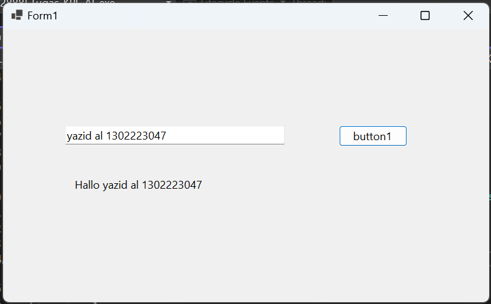
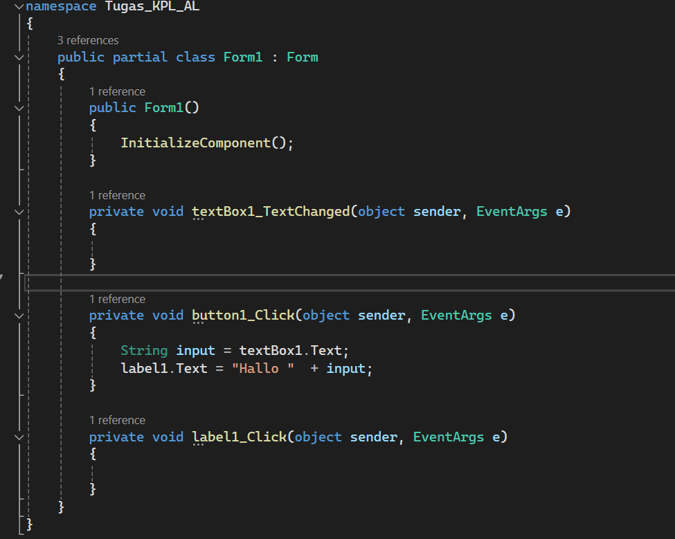

# Penjelasan 

# Output

# Source Code

String input di assign ke identifier dari textboxt.
kemudian identifier dari label akan di masukkan ke dalam sebuah string yang nantinya akan mengahilkan output
kemudian output akan keluar sesuai dengan nilai yang di inputkan di textbox.

Terimakasih!